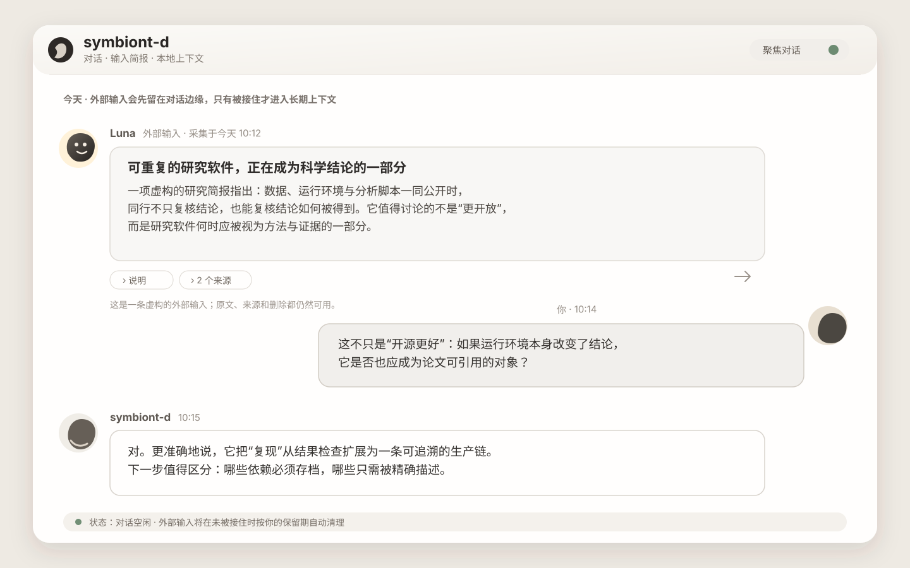

# symbiont-d


[中文](#中文) · [English](#english)

---

<a id="中文"></a>

## 中文

> **开发预览。** symbiont-d 的接口、配置和本地数据格式仍可能调整。建议在测试环境中使用，并备份 `data/` 中需要保留的数据。

symbiont-d 是一个本地运行的对话与信息整理服务。日常对话通过 Codex app-server 完成；定时探索、IMAP 邮箱和 Google Drive 等外部输入可进入同一个时间线；长期上下文通过 [Paged Context Protocol (PCP)](https://github.com/glenzli/paged-context-protocol) 存储和检索。

项目目前面向单用户、本机部署。Codex 仍负责任务执行、审批和进度管理；symbiont-d 负责对话、输入整理和上下文衔接。



*示例界面使用虚构数据。*

### 组件关系

```text
定时探索 / IMAP / Google Drive / 选定的 Codex 上下文
                          │
                          ▼
                    symbiont-d
       ├─ Codex app-server
       ├─ 本地 SQLite / 配置
       ├─ PCP Runtime
       └─ infer-runtime（可选）
```

- **Codex app-server** 提供普通对话、工具调用和定向调查。
- **本地存储** 保存对话、输入状态和运行配置。
- **PCP Runtime** 独立管理 Pages、Revision、来源、关系和检索；symbiont-d 通过 enrollment 连接。
- **infer-runtime** 是可选依赖，用于本地语音转写和部分无状态判断。

### 当前能力

- **对话界面**：支持流式回复、停止、编辑、撤回和重发，并在本地保存对话记录。
- **外部输入**：支持可选的 IMAP 收件箱和 Google Drive 只读接入，以及定时探索和手动调查。输入保留来源，未发布的候选不会写入 PCP。
- **长期上下文**：symbiont-d 按运行策略判断普通内容是否需要记录；PCP 负责持久化、版本和检索。
- **临时讨论**：在进程内保存独立对话。默认丢弃，也可由用户选择保留结论或完整记录。
- **语音输入**：通过可选的 infer-runtime 转写本地录音；音频文件本身不写入 PCP。
- **Codex 调用**：仓库附带只读的 `$symbiont` Codex Skill，用于把限定范围的上下文和来源带入当前任务。

### 当前边界

- 服务默认只监听 `127.0.0.1:4317`，没有公共托管或多用户部署配置。
- PCP Runtime 与 Console 由 PCP 仓库独立安装和运行；symbiont-d 的安装脚本不会管理或卸载它们。
- 邮箱、Drive、模型服务和 infer-runtime 均需单独配置。本仓库不包含账号凭据、API Key、邮箱地址、Drive 标识或模型文件。
- 外部输入通道是只读的；来源服务不可用时，相关功能会报告不可用或失败状态。
- 当前版本不承诺配置、数据库或 PCP 客户端接口向后兼容。

### 运行开发版

需要 Rust 1.88+、已登录的 Codex CLI，以及位于同级目录的 [PCP 仓库](https://github.com/glenzli/paged-context-protocol)：

```sh
cargo run
```

打开 <http://127.0.0.1:4317>。作为 macOS 本地常驻服务安装：

```sh
./scripts/service-install.sh
./scripts/service-status.sh
```

请先通过 PCP 自己的安装入口启动 Runtime 与 Console，再在 Console 中批准 symbiont-d 的 enrollment。

### 项目导航

- [外部输入角色与生命周期](docs/signal-input-roles.md)
- [临时讨论边界](docs/ephemeral-discussions.md)
- [Codex Skill](integrations/codex-skill/symbiont/SKILL.md)
- [安装 Codex Skill](scripts/install-codex-skill.sh)

---

<a id="english"></a>

## English

> **Development preview.** symbiont-d interfaces, configuration, and local data formats may change. Use it in a test environment and back up any data under `data/` that needs to be retained.

symbiont-d is a locally run conversation and information-management service. Ordinary conversation uses Codex app-server; scheduled exploration, IMAP mail, and Google Drive can add external input to the same timeline; durable context is stored and retrieved through [Paged Context Protocol (PCP)](https://github.com/glenzli/paged-context-protocol).

The project currently targets a single-user local deployment. Codex remains responsible for task execution, approvals, and progress tracking. symbiont-d handles conversation, input organization, and context transfer.


*The example uses fictional data.*

### Components

```text
scheduled exploration / IMAP / Google Drive / selected Codex context
                                │
                                ▼
                          symbiont-d
             ├─ Codex app-server
             ├─ local SQLite/config
             ├─ PCP Runtime
             └─ infer-runtime (optional)
```

- **Codex app-server** provides ordinary conversation, tool calls, and directed investigation.
- **Local storage** holds transcripts, input state, and runtime configuration.
- **PCP Runtime** independently manages Pages, Revisions, sources, relations, and retrieval; symbiont-d connects through enrollment.
- **infer-runtime** is optional and provides local speech transcription and some stateless judgments.

### Available in the current build

- **Conversation UI**: streaming responses, stop, edit, retract, and resend, with a locally stored transcript.
- **External input**: optional read-only IMAP and Google Drive connections, scheduled exploration, and manual investigation. Inputs retain their sources; unpublished candidates do not enter PCP.
- **Durable context**: symbiont-d applies its runtime policy to ordinary recording; PCP provides persistence, revision history, and retrieval.
- **Temporary discussions**: isolated in-process conversations that are discarded by default. The user may retain a conclusion or the full transcript.
- **Voice input**: local recordings can be transcribed through optional infer-runtime. Audio files are not written to PCP.
- **Codex recall**: the repository includes a read-only `$symbiont` Codex Skill for bringing bounded context and sources into the current task.

### Current boundaries

- The service listens on `127.0.0.1:4317` by default. There is no public hosting or multi-user deployment configuration.
- PCP Runtime and Console are installed and run independently from the PCP repository. The symbiont-d installer does not manage or remove them.
- Mail, Drive, model services, and infer-runtime require separate configuration. This repository contains no account credentials, API keys, mail addresses, Drive identifiers, or model files.
- External input connections are read-only. When a source service is unavailable, the corresponding feature reports an unavailable or failed state.
- The current release does not guarantee backward compatibility for configuration, databases, or PCP client interfaces.

### Run the development build

The build requires Rust 1.88+, a signed-in Codex CLI, and a sibling checkout of the [PCP repository](https://github.com/glenzli/paged-context-protocol):

```sh
cargo run
```

Open <http://127.0.0.1:4317>. To install it as a persistent local macOS service:

```sh
./scripts/service-install.sh
./scripts/service-status.sh
```

Start Runtime and Console through PCP's own installation path, then approve the symbiont-d enrollment in Console.

### Project navigation

- [External-input roles and lifecycle](docs/signal-input-roles.md)
- [Temporary-discussion boundary](docs/ephemeral-discussions.md)
- [Codex Skill](integrations/codex-skill/symbiont/SKILL.md)
- [Codex Skill installer](scripts/install-codex-skill.sh)

## License

symbiont-d is available under the [MIT License](LICENSE).
